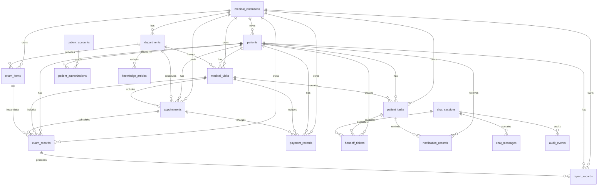

# 数据库表关系文档

<!-- 本文作用：说明患者端医疗服务智能客服数据库表之间的主外键关系、业务关系和核心查询链路。 -->

## 当前 MD 的作用

本文件用于帮助开发、测试和产品理解数据库表如何关联。它和 `数据库表结构文档.md` 配套使用：表结构文档看字段和 SQL，本文件看关系和业务流。

## 关系总览



## 核心主外键关系

| 从表 | 字段 | 主表 | 关系说明 |
| --- | --- | --- | --- |
| `departments` | `institution_id` | `medical_institutions.id` | 一个机构下有多个科室 |
| `patients` | `institution_id` | `medical_institutions.id` | 就诊人归属于某个机构 |
| `patient_authorizations` | `account_id` | `patient_accounts.id` | 一个账号可绑定多个就诊人 |
| `patient_authorizations` | `patient_id` | `patients.id` | 一个就诊人可授权给多个账号 |
| `medical_visits` | `patient_id` | `patients.id` | 一个就诊人有多次就诊 |
| `medical_visits` | `department_id` | `departments.id` | 一次就诊可关联一个科室 |
| `appointments` | `patient_id` | `patients.id` | 一个就诊人有多条预约 |
| `appointments` | `department_id` | `departments.id` | 一条预约归属一个科室 |
| `appointments` | `visit_id` | `medical_visits.id` | 预约可关联一次就诊 |
| `exam_items` | `department_id` | `departments.id` | 检查检验项目由科室提供 |
| `exam_records` | `exam_item_id` | `exam_items.id` | 检查记录来自一个项目 |
| `exam_records` | `appointment_id` | `appointments.id` | 检查记录可来自检查预约 |
| `report_records` | `exam_record_id` | `exam_records.id` | 一次检查可产生报告 |
| `payment_records` | `appointment_id` | `appointments.id` | 缴费可关联预约 |
| `patient_tasks` | `visit_id` | `medical_visits.id` | 就诊记录可产生患者待办 |
| `chat_sessions` | `account_id` | `patient_accounts.id` | 会话由登录账号发起 |
| `chat_sessions` | `patient_id` | `patients.id` | 会话可绑定当前服务就诊人 |
| `chat_messages` | `session_id` | `chat_sessions.id` | 一次会话包含多条消息 |
| `handoff_tickets` | `session_id` | `chat_sessions.id` | 工单可由会话升级产生 |
| `handoff_tickets` | `task_id` | `patient_tasks.id` | 工单可关联患者待办 |
| `audit_events` | `session_id` | `chat_sessions.id` | 审计事件可关联会话 |
| `notification_records` | `task_id` | `patient_tasks.id` | 通知可关联患者待办 |

## 患者首页查询链路

```text
patient_accounts
  -> patient_authorizations
  -> patients
  -> patient_tasks
  -> appointments / exam_records / report_records / payment_records
```

说明：

1. 账号登录后，先通过 `patient_authorizations` 找到本人或被授权就诊人。
2. 首页优先查询 `patient_tasks`，展示待办卡。
3. 待办卡通过 `source_type`、`source_id` 回到预约、检查、报告或缴费对象。
4. 如果权限校验失败，不继续查询业务详情。

## 检查检验闭环关系

```text
appointments
  -> exam_records
  -> report_records
  -> patient_tasks
  -> notification_records
```

说明：

1. 检查预约生成后，创建或更新 `exam_records`。
2. 检查状态从 `ordered`、`paid`、`scheduled`、`checked_in`、`completed` 流转到 `reported`。
3. 报告状态写入 `report_records`，只保存报告入口和脱敏摘要，不保存完整报告正文。
4. 首页待办由 `patient_tasks` 聚合展示。
5. 报告已出、检查前提醒等通过 `notification_records` 记录通知。

## 对话与人工转接关系

```text
chat_sessions
  -> chat_messages
  -> handoff_tickets
  -> audit_events
```

说明：

1. 患者咨询进入 `chat_sessions`。
2. 脱敏后的对话消息进入 `chat_messages`。
3. 触发人工转接时，生成 `handoff_tickets`，并关联当前会话和患者任务。
4. 风险命中、身份校验、业务查询、人工转接都写入 `audit_events`。

## 权限与隐私关系

```text
patient_accounts
  -> patient_authorizations
  -> patients
  -> medical_visits / appointments / exam_records / report_records
```

说明：

1. 患者业务查询必须先校验账号和就诊人授权关系。
2. 代办人只能查看授权范围内的数据。
3. 报告、就诊、缴费等敏感信息必须记录访问审计。
4. 对话、工单和通知只保存脱敏摘要，避免把本库变成敏感原文仓库。

## 设计注意事项

1. `patient_tasks.source_type` 和 `patient_tasks.source_id` 是弱关联，用于承载多种待办来源；业务服务查询时必须二次校验来源对象权限。
2. `report_records.report_url` 只作为报告入口，不保存报告正文和医学解释。
3. `risk_rules` 是确定性安全规则，不应只依赖大模型判断风险。
4. `audit_events.metadata_json` 只能写脱敏信息，不能写完整请求体或外部系统原文返回。
